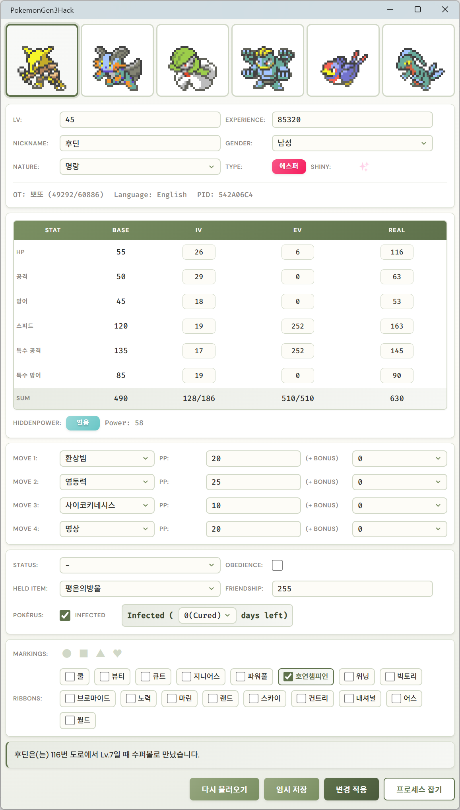

# Pokemon Emerald Trainer

Pokemon Emerald 3세대 기반 ROM의 실행 중 메모리를 읽고, 파티 포켓몬 데이터를 확인하거나 수정하는 Windows용 트레이너입니다.



## 다운로드

GitHub 사용이 익숙하지 않다면, 소스 코드 파일을 직접 받지 말고 **Releases**에서 배포 파일을 받으면 됩니다.

1. 이 페이지 오른쪽의 **Releases** 영역을 찾습니다.
2. 최신 버전의 릴리즈를 클릭합니다.
3. `PokemonGen3Hack-v...-win-x64.zip` 파일을 다운로드합니다.
4. 압축을 풉니다.
5. 폴더 안의 `PokemonGen3Hack.exe`를 실행합니다.

압축을 푼 뒤 보이는 `app` 폴더는 실행에 필요한 파일들이 들어 있는 폴더입니다. 삭제하거나 이름을 바꾸면 실행되지 않습니다.

## 사용 전 확인

- Windows 10 이상에서 사용하세요.
- .NET 10 Runtime이 필요합니다.
- 화면이 열리지 않거나 하얗게 표시되면 [Microsoft Edge WebView2 Runtime](https://developer.microsoft.com/microsoft-edge/webview2/consumer/)을 설치하세요.
- 에뮬레이터와 ROM을 먼저 실행한 뒤, 앱에서 **프로세스 잡기**를 선택하세요.
- 메모리 읽기가 실패하면 앱을 관리자 권한으로 실행해야 할 수 있습니다.
- 지원하지 않는 에뮬레이터나 ROM 버전에서는 데이터가 올바르게 표시되지 않을 수 있습니다.

## 주요 기능

- 실행 중인 에뮬레이터 프로세스 선택
- 파티 포켓몬 데이터 읽기
- 레벨, 경험치, 성격, 성별, 색이 다른 포켓몬 여부 수정
- IV, EV, 실제 능력치 수정
- 기술, PP, PP 보너스 수정
- 상태 이상, 지닌 도구, 친밀도, 포켓러스, 마킹, 리본 수정
- 변경 내용을 에뮬레이터 메모리에 다시 쓰기

## 개발자용 빌드

필요 환경:

- .NET 10 SDK
- .NET MAUI Windows workload

Release 패키지 생성:

```powershell
powershell -NoProfile -ExecutionPolicy Bypass -File .\scripts\package-release.ps1
```

생성 결과:

```text
dist/
  PokemonGen3Hack-v1.0.0-win-x64/
    PokemonGen3Hack.exe
    app/
  PokemonGen3Hack-v1.0.0-win-x64.zip
```
